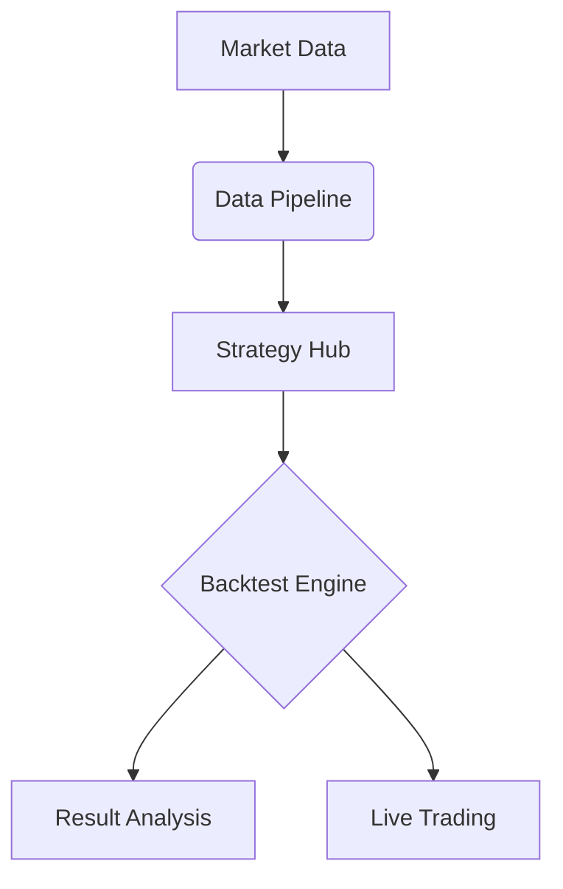
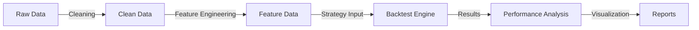

# KingCool - Quantitative Stock Trading Experiment

 English | [中文](README.zh-CN.md)

## Overview

**KingCool** is a modular quantitative trading experiment platform focused on stock trading, providing a complete toolchain:

- 📊 Market data acquisition and processing
- ⚙️ Strategy development and backtesting
- 📈 Performance analysis and optimization



## Core Components

### 1. Data Services

Unified data interface supporting multiple sources:

#### Data Sources

| Source        | URL   |  Launch Date  |
| :--------:  | :-----:  | :----:  |
| East Money | [https://www.eastmoney.com/](https://www.eastmoney.com/) |2025-05-01|
| Sina Finance | [https://vip.stock.finance.sina.com.cn/mkt/](https://vip.stock.finance.sina.com.cn/mkt/) |2025-05-01|
| Tencent Stocks | [https://stockapp.finance.qq.com/](https://stockapp.finance.qq.com/) |2025-05-01|

#### Data Retrieval Example

```python
from king_cool_quant_data.query import stock_info_a_code_name, get_stock_hist_data

code_name = stock_info_a_code_name()
print(code_name.head())

hist_data = get_stock_hist_data('000001', 'hfq', '2025-01-01', '2025-05-31')
print(hist_data.head())
```

#### Data Parameters

| Parameter        | Type   |  Description  |
| :--------:  | :-----:  | :----:  |
| code | string | Stock code |
| adj | string | Data type: raw-original, qfq-forward adjusted, hfq-backward adjusted |
| start_date | string | Start date |
| end_date | string | End date |

### 2. Backtest Engine

Under development, stay tuned!

### 3. Strategy Repository

#### Ready-to-use quantitative strategies:

| Strategy        | Location   |  Parameters  |  Author  |
| :--------:  | :-----:  | :----:  | :----:  |
| Mean Reversion | strategies/mean_reversion.py | window=20, z_threshold=1.8 | [StevewJin](https://github.com/StevewJin/) |
| Moving Average Crossover | strategies/moving_average.py | short=10, long=50 | [StevewJin](https://github.com/StevewJin/) |
| Volatility Breakout | strategies/volatility_breakout.py | atr_window=14, multiplier=1.5 | [StevewJin](https://github.com/StevewJin/) |
| Pairs Trading | strategies/pairs_trading.py | coint_window=60, entry_z=1.5 | [StevewJin](https://github.com/StevewJin/) |
| Momentum Rotation | strategies/momentum_rotator.py | lookback=21, top_n=5 | [StevewJin](https://github.com/StevewJin/) |

#### Strategy Code Example (Volatility Breakout)

```python
# strategies/volatility_breakout.py
import talib

class VolatilityBreakout:
    def __init__(self, atr_window=14, multiplier=1.5):
        self.atr_window = atr_window
        self.multiplier = multiplier
        
    def generate_signals(self, data):
        data['atr'] = talib.ATR(data['high'], data['low'], data['close'], self.atr_window)
        data['upper_band'] = data['open'] + (self.multiplier * data['atr'])
        signals = (data['close'] > data['upper_band']).astype(int)
        return signals
```

## Getting Started

### Installation

#### 1. Clone repository:

```bash
git clone https://github.com/StevewJin/king-cool-python.git
cd kingcool
```

#### 2. Create environment:

```bash
conda create -n kingcool python=3.10
conda activate kingcool
```

#### 3. Install dependencies:

```bash
pip install -r requirements.txt
```

### Run Tests

```bash
python tests.test_some.py
```

## Data Lineage



## Contribution Guidelines

### 1. New Strategy Requirements:

- Must implement generate_signals() method
- Include parameter documentation
- Provide test cases

### 1. Data Module Specifications:

- Follow unified data interface
- Handle data gaps
- Implement caching mechanism

## Disclaimer

⚠️ For Research Purposes Only​

This software does not constitute any investment advice. Past performance ≠ future results. Trading involves significant risk of loss. Users assume all responsibility.

## License

MIT License - See [License](LICENSE)