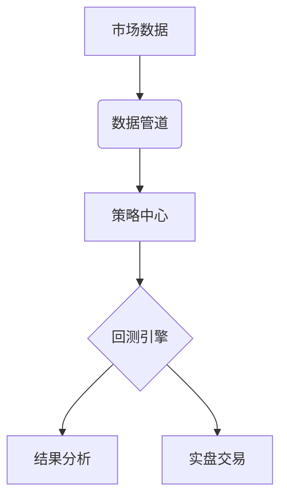

# 金酷 - 量化股票交易实验

 [English](README.md) | 中文

## 概述

**金酷** 是专注于股票交易的模块化量化交易实验平台，提供完整工具链：

- 📊 市场数据获取与处理
- ⚙️ 策略开发与回测
- 📈 绩效分析与优化



## 核心组件

### 1. 数据服务

统一数据接口支持多种来源：

#### 数据源

| 来源        | 地址   |  上线日期  |
| :--------:  | :-----:  | :----:  |
| 东方财富 | [https://www.eastmoney.com/](https://www.eastmoney.com/) |2025-05-01|
| 新浪股票 | [https://vip.stock.finance.sina.com.cn/mkt/](https://vip.stock.finance.sina.com.cn/mkt/) |2025-05-01|
| 腾讯股票 | [https://stockapp.finance.qq.com/](https://stockapp.finance.qq.com/) |2025-05-01|

#### 数据获取示例

```python
from king_cool_quant_data.query import stock_info_a_code_name, get_stock_hist_data

code_name = stock_info_a_code_name()
print(code_name.head())

hist_data = get_stock_hist_data('000001', 'hfq', '2025-01-01', '2025-05-31')
print(hist_data.head())
```

#### 数据参数说明

| 参数名        | 类型   |  描述  |
| :--------:  | :-----:  | :----:  |
| code | string | 股票代码 |
| adj | string | 数据类型 raw-原始数据 qfq-前复权数据 hfq-后复权数据 |
| start_date | string | 数据开始日期 |
| end_date | string | 数据结束日期 |

### 2. 回测引擎

开发中，敬请期待！

### 3. 策略仓库

#### 开箱即用的量化策略：

| 策略类型        | 文件位置   |  参数  |  作者  |
| :--------:  | :-----:  | :----:  | :----:  |
| 均值回归​ | strategies/mean_reversion.py | window=20, z_threshold=1.8 | [StevewJin](https://github.com/StevewJin/) |
| 均线交叉​ | strategies/moving_average.py | short=10, long=50 | [StevewJin](https://github.com/StevewJin/) |
| 波动率突破​ | strategies/volatility_breakout.py | atr_window=14, multiplier=1.5 | [StevewJin](https://github.com/StevewJin/) |
| ​​配对交易​ | strategies/pairs_trading.py | coint_window=60, entry_z=1.5 | [StevewJin](https://github.com/StevewJin/) |
| ​​动量轮动​ | strategies/momentum_rotator.py | lookback=21, top_n=5 | [StevewJin](https://github.com/StevewJin/) |

#### 策略代码示例（波动率突破）

```python
# strategies/volatility_breakout.py
import talib

class VolatilityBreakout:
    def __init__(self, atr_window=14, multiplier=1.5):
        self.atr_window = atr_window
        self.multiplier = multiplier
        
    def generate_signals(self, data):
        data['atr'] = talib.ATR(data['high'], data['low'], data['close'], self.atr_window)
        data['upper_band'] = data['open'] + (self.multiplier * data['atr'])
        signals = (data['close'] > data['upper_band']).astype(int)
        return signals
```

## 快速开始

### 安装

#### 1. 克隆仓库：

```bash
git clone https://github.com/StevewJin/king-cool-python.git
cd kingcool
```

#### 2. 创建环境：

```bash
conda create -n kingcool python=3.10
conda activate kingcool
```

#### 3. 安装依赖：

```bash
pip install -r requirements.txt
```

### 运行测试

```bash
python tests.test_some.py
```

## 数据谱系


## 贡献指南

### 1. 新增策略要求​​：

- 必须实现 generate_signals() 方法
- 包含参数文档说明
- 提供测试用例

### 1. ​​数据模块规范​​：

- 遵循统一数据接口
- 处理数据断层
- 实现缓存机制

## 免责声明

⚠️ ​​仅限研究用途​​

本软件不构成任何投资建议。历史表现 ≠ 未来结果。交易存在重大亏损风险，使用者承担全部责任。

## 许可协议

MIT License - 详见 [License](LICENSE)